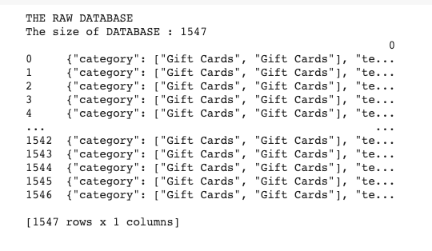
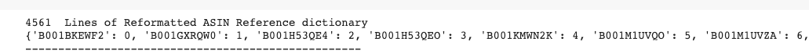
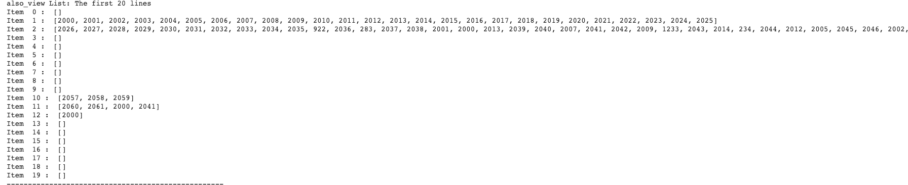
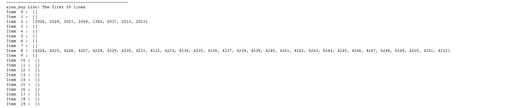
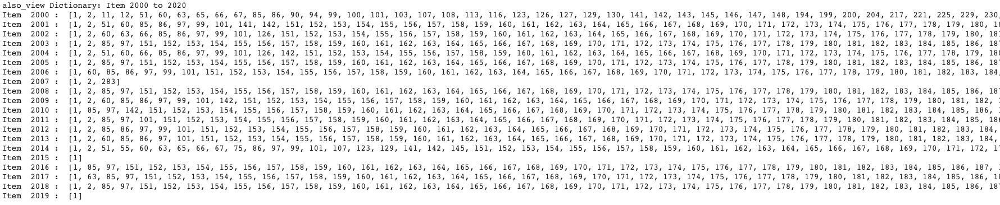
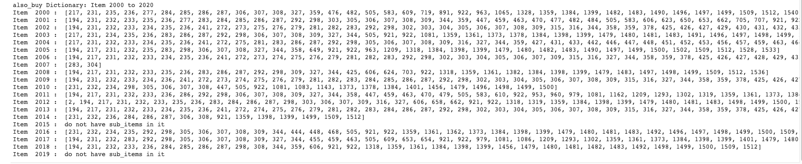
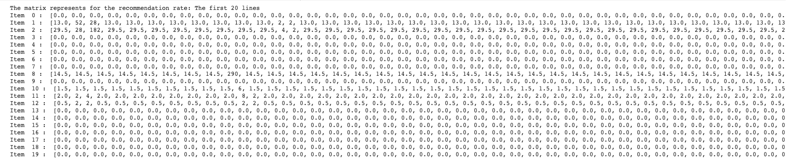
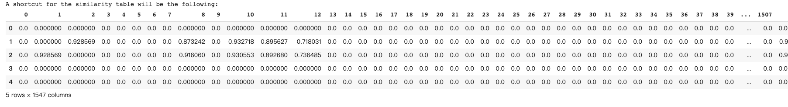

# Big Data Application in E-commerce

- [ ] please use refernces
- [ ] Please add an empty line after a heading
- [ ] please follow oure template, see image inclusions, fix errors reported by report check script

Status: in progress

Tao Liu, [fa20-523-339](https://github.com/cybertraining-dsc/fa20-523-339/), [Edit](https://github.com/cybertraining-dsc/fa20-523-339/blob/main/project/project.md)

{}

## Abstract

As a result of last twenty year's Internet development in the global, E-commerce industry is getting stronger and stronger. While customers enjoyed their convenient online purchase environment, the E-commerce see the potential for the data and information customer left during their online-shopping process. One fundamental usage for this information is to perform Recommendation Strategy to give customer potential products they would also like to purchase.  This report will try to build a User-Based Collaborative Filtering strategy to give customer recommendation products based on the database of previous customer purchase records. This report will start with an overview for the background and then an expansion for the dataset it chosen *Amazon Review Data*. After that each step for the code and step made in a corresponding file *Big_tata_Application_in_E_commense.ipynb* will be illustrated and the User-Based Collaborative Filtering strategy will be presented step by step.

Contents



{}

**Keywords:** recommendation strategy,collaborative filtering, business, big data, E-commerce, customer behavior 

## 1. Introduction

Big data have many applications in the scientific research and business, from those in the hardware perspective like Higgs Discovery to the software perspective like E-commence. However, with the passage of time, the online shopping and E-commerce have now become one of the most popular events for citizen's life and society. Millions of goods are now sale online to the customers all over the world. With the 5G technology's implementation is inevitable. These activities will create millions of data about customer's behaviors like how they value products, how they purchase or sale the products and how they review for the goods purchase. These data will have a tremendous contribution for corporations to analyze. These data can not only help convince the current strategies of the E-commerce is on a right track, but also a potential way to see which step E-commerce can make up for attracting more customers to buy the goods. At the same time, these data can also be implemented as a way for recommendation strategies for E-commerce. It will help customers find the next products they like in a short period by implementing machine learning technology on Big Data. The corporations also can enjoy the increase of sale and potential of more attraction for recommendation strategies. A better recommendation strategy on E-commerce is now the new trend for massive data scientists and researchers’ target. Therefore, this field is now one the most popular research area in the data science fields. 

In this final project, An User-Based Collaborative Filtering Strategy will be implemented to get a taste on the recommendation strategy based on Customer's Gift card purchase record and the item they also viewed and bought. The logic behind the algorithm is the following: A used record indicates that customer who bought the product A and also view/buy products B&C. They when a new customer comes and indicates his interest of B&C, the product A would be recommended to him. This logic is addressed based on daily-experience of customer behaviors on their E-commerse experience. 

## 2. Background

Recommendation Strategy is a quite popular research area in recent years with a strong real-world influence. It is largely used in E-commerse platform like Taobao, Amazon,etc. Therefore, It is obvious that there are plenty of recommendation strategy have been done. Though every E-commerse's recommendation algorithm may be different with each other, the most poplular techique for recommendation systems is called Collaborative Filtering. It is a techique that can filter out items that a user might like on the basis of reactions by similar users. During this techique, the memory-based method is considered in this report since it uses dataset to calculate the prediction by using statistical techniques. This strategy will be able to fulfill in local environment with a proper dataset. There are two kinds of memory-based method available in the market: *User-Based Collaborative Filtering*, *Item-Based Collaborative Filtering* [^1]. This project will be only focus on User-Based Collaborative Filtering Strategy since Item-Based Collaborative Filtering requires a customer review rate for evaluation. The dataset available in the market does not have that attribute and therefore be unlikely to implement in that way. 

## 3. Choice of Data-sets

The dataset for this study is called *Amazon Review Data* [^2]. Particularly, since the dataset is now reach billions of amount,the subcategery gift card will be used as an example, since the overall customer record is 1547 and the amount of data retrieved is currently in the right amount of training. This fact can help to perform User-Based Collaborative Filtering in a control timeline.

## 4. Data Preprocessing and cleaning

The first step will be data collection and data cleaning. The raw data-set is imported directly from data-set contributors' online storage *meta_Gift_Cards.json.gz* [^3] to Google Colab notebook. The raw database retreived directly from the website will be the following:

|  Attribute   | Description                    |  Example                                |
| :-----------:| :-----------------------------:|:---------------------------------------:|
|  category    | The category of the record     | \[\"Gift Cards", "Gift Cards"\]\        |
|  tech1       | tech relate to it              | ""                                      |
|  description | The description of the product |"Gift card for the purchase of goods..." |
|  fit         | fit for its record             |""                                       |
|  title       | title for the product          |"Serendipity 3 $100.00 Gift Card"        |
| **also_buy** | the product also bought        |\[\"B005ESMEBQ"\]\                       |
|  image       | image of the gift card         |""                                       |
|  tech2       | tech relate to it              |""                                       |
|  brand       | brand of the product           |"Amazon"                                 |
|  feature     | feature of the product         |"Amazon.com Gift cards never expire"     |
|  rank        | rank of the product            |""                                       |
| **also_view**| the product also view          |\[\"BT00DC6QU4"\]\                       |
|  details     | detail for the product         |"3.4 x 2.1 inches ; 1.44 ounces"         |
|  main_cat    | main category of the product   |"Grocery"                                |
|  similar_item| similar_item of the product    |""                                       |
|  date        | date of the product assigned   |""                                       |
|  price       | price of the product           |""                                       |
|  **asin**    | product asin code              |"B001BKEWF2"                             |

Here since the attributes *category*, *main_cat* are the same for the whole dataset,they will not be a valid training labels. The attributes *tech1*, *fit*, *tech2*, *rank*, *similar_item*, *date*, *price*  have no/ extremely less filled in. That made them also unvalid for being training labels.The attributes *image*, *description* and *feature* is unique per item and hard to find the similarity in numeric purpose and then hard to be used as labels. Therefore, only attributes **also_buy**,  **also_view**, **asin** is trained as attributes and label in this algorithm.

Here is a shortcut for the raw database:

For the training purpose, all asins appeared in the dataset, either from *also_buy & also_view* list or * asin* have to be reformatted from alphabet character to numeric character. Therefore, a reformat_asin function is called for reformatting all the asins appeared in the dataset and is performed as a dictionary. 

A shortcut for the *Asin Dictionary* is like the following:

Then the data contained in the each record's attributes: **also_view** & **also_buy** will be reformated as following:

A dictionary of the asin's relationship with particular record in also_view is recorded. An example from item 2000 to 2020 is showingas following.

A dictionary of the asin's relationship with particular record in also_buy is also recorded. An example from item 2000 to 2020 is showingas following.

## 5. Recommendation Rate and Similarity Calculation

This section will be addressed upon project completion.

## 6. Conclusion

This section will be addressed upon project completion.

## 7. Acknowledgements

The author would like to thank Dr. Gregor Von Laszewski, Dr. Geoffrey Fox, and the associate instructors in the *FA20-BL-ENGR-E534-11530: Big Data Applications* course (offered in the Fall 2020 semester at Indiana University, Bloomington) for their continued assistance and suggestions with regard to exploring this idea and also for their aid with preparing the various drafts of this article.

## 8. References

[^1]: Build a Recommendation Engine With Collaborative Filtering Ajitsaria, A 2020 
      <https://realpython.com/build-recommendation-engine-collaborative-filtering/> 

[^2]: Justifying recommendations using distantly-labeled reviews and fined-grained aspects. Jianmo Ni, Jiacheng Li, Julian McAuley. Empirical Methods in Natural Language Processing (EMNLP), 2019 <http://jmcauley.ucsd.edu/data/amazon/> 

[^3]: meta_Gift_Cards.json.gz <http://deepyeti.ucsd.edu/jianmo/amazon/metaFiles/meta_Gift_Cards.json.gz>

